## Approaches undertaken

<font size="5">Our project focused on Moving Averages (MAs), utilizing Crossing EMAs and Single EMA for both asset groups. We optimized MA parameters for each asset, incorporating them into the portfolio based on Net P&L in both Momentum and Mean-Reverting Strategies.</font>

<font size="5">No additional assumptions have been considered, only the commonly accepted ones for both Group 1 and Group 2.</font>

<font size="5">To determine optimal MAs parameters, we utilized both the HeatMap method and manual exploration. Our primary focus was identifying the most profitable configurations across the entire timeframe. In cases where multiple settings proved lucrative, we assessed their consistency in generating profits on a quarterly basis.</font>

## Finally selected strategy for **group 1**

<font size="3">When assessing Group 1 assets encompassing two indexes, our analysis spanned Momentum and Mean-Reverting strategies. However, we encountered challenges in achieving positive P&Ls with the Mean-Reverting approach. Consequently, our focus shifted towards a Trending strategy, for which we identified optimal parameters leading to favorable outcomes.

In comparing strategies, the Crossing EMAs technique exhibited superior P&Ls compared to the Single EMA method. As a result, we opted for the Crossing EMAs approach and implemented the following set of parameters:</font>

`NASDAQ - 35/134`

`SP500 - 55/80`

```{r, echo = F, warning = F, message = F}
# here you can refer to the R codes that apply the strategy
# for asset group 1 to all quarters (in a loop)

source("1_best.R")
```

## Summary of results for **group 1**

```{r, echo = F}
column_spec(
kable_styling(kable(quarter_stats.all.group1[, -2], 
                    "html", 
                    digits = 2,
                    align = "r"),
             font_size = 15),
1:7, width = "30em")
```

<font size="3">Even though we have positive Gross P&L for each quarter, due to the transaction costs, our Net P&L has become negative for two quarters. However, in comparison with the quarters which are positive, these losses do not have a huge impact on our model's overall performance.</font>

<font size="3">In reality, it is not always achievable to make profit consistently.</font>

## PnL **Group 1** -- 2021Q1

```{r, echo = F, out.width ='80%'}
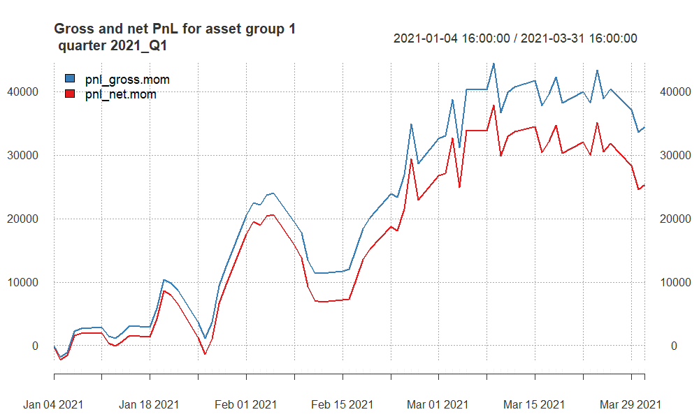
```

<font size="3">Began with modest returns, saw a significant profit surge in the second part of the quarter, but ended with a decrease in Net P&L from roughly \$37,000 to \$25,000 due to unprofitable final transactions.</font>

## PnL **Group 1** -- 2021Q3

```{r, echo = F, out.width ='80%'}
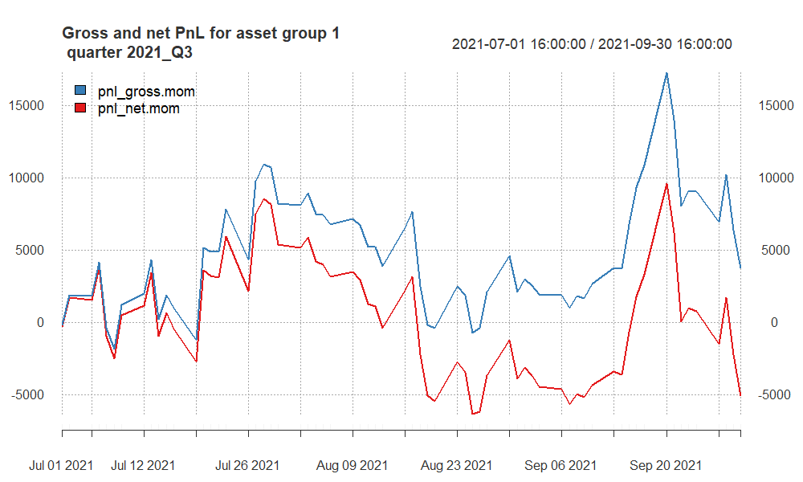
```

<font size="3">It has the lowest Net P&L value. Especially recent transactions have completely eradicated any earnings. In general, there is a considerable amount of erratic movement, particularly with a negative impact.</font>

## PnL **Group 1** -- 2021Q4

```{r, echo = F, out.width ='80%'}
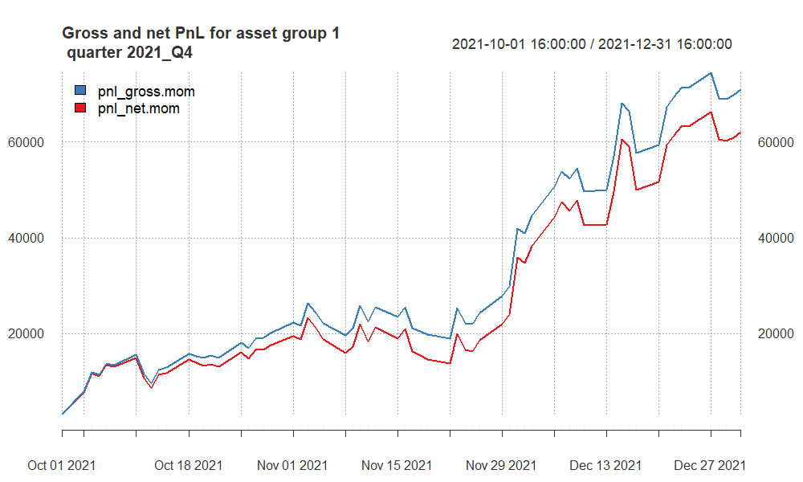
```

<font size="3">The quarter marked the highest profitability, yielding a net profit of around \$62,000. The strategy has consistently stayed in positive territory, ensuring a continuous stream of profits throughout the entire quarter. The higher Sharpe ratio and Stat indicates strong risk-adjusted returns and the statistical significance, respectively.</font>

## PnL **Group 1** -- 2022Q2

```{r, echo = F, out.width ='80%'}
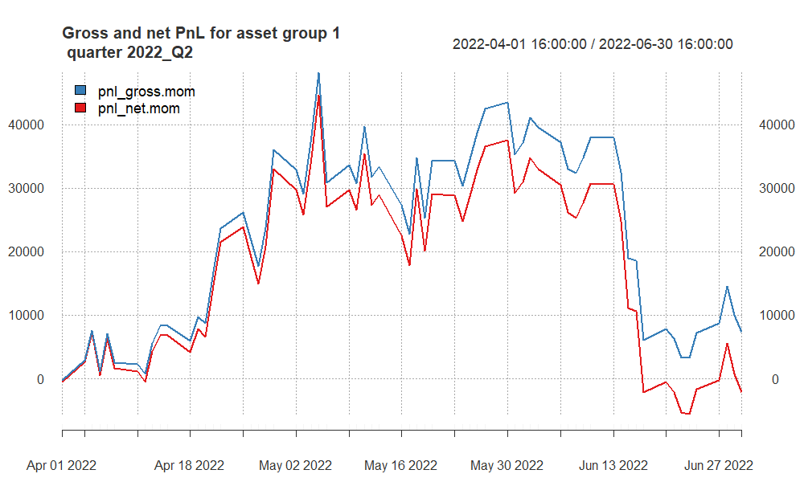

```

<font size="3">During this quarter, the number of average daily trades is the highest. The strategy proved itself in the mid-quarter, but ended up with negative return due to losses from positions as well as transaction costs.</font>

## PnL **Group 1** -- 2022Q4

```{r, echo = F, out.width ='80%'}
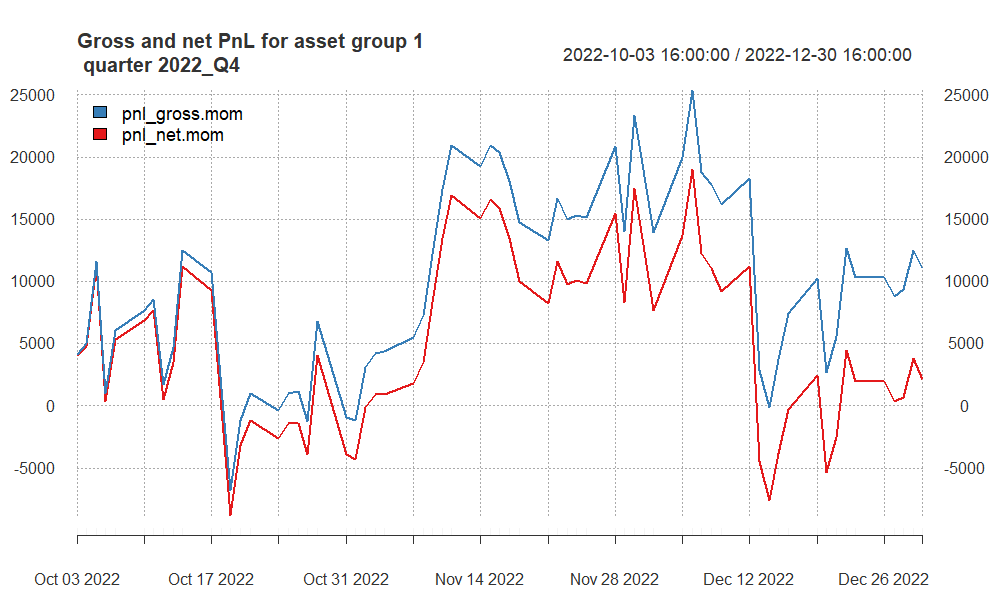

```

<font size="3">This quarter shows positive success rates, gains before and after costs. The difference between Gross and Net is about \$9,000 - our gains from positions has not been that much, mostly small gains from a lot of positions. This is the reason why we have \$9,000 transaction costs.</font>

## PnL **Group 1** -- 2023Q1

```{r, echo = F, out.width ='80%'}
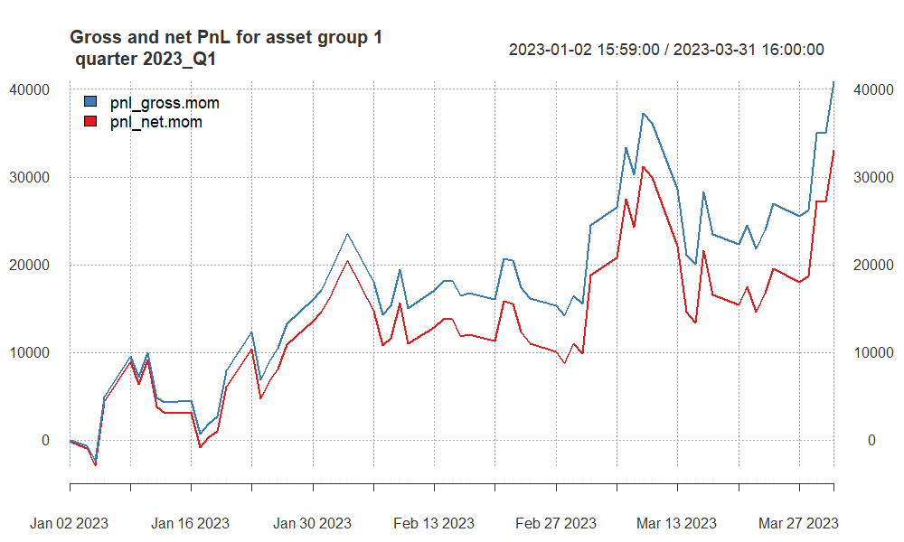

```

<font size="3">The approach consistently maintained a profitable P&L, and recent transactions have propelled it to its peak P&L level. For such a significant profit, transaction costs are only \$ 8,000. Unlike 2022Q4, we have entered **fewer trades**, but **profitable** ones.</font>

## PnL **Group 1** -- 2023Q2

```{r, echo = F, out.width ='80%'}
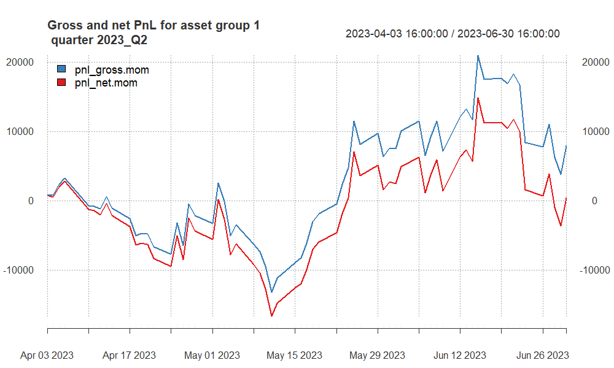

```

<font size="3">Following a challenging first half of the quarter marked by substantial losses, the strategy managed to recover in the latter part, yielding a profit of \$15,000. Unfortunately, the positive trend was short-lived, as the strategy experienced a subsequent decline, nearly reaching zero.</font>

## Finally selected strategy for **group 2**

<font size="3">For Group 2 assets which includes two currencies and two commodities, we checked Momentum and Mean-Reverting strategies. Based on our research we decided to continue with to Mean-Reverting strategy because of its profitability.</font>

<font size="3">We started with finding the optimal parameters for each of them individually, and then combining as a portfolio the ones that reached desirable outcomes.</font>

<font size="3">After our research, we decided to remove AUD and CAD. They didn't yield much profit and the results was not reliable for such reason.</font>

<font size="3">The P&Ls of Crossing EMAs was higher that Single EMA technique, so we preferred Crossing EMAs approach and used below parameters:</font>

`XAG - 67/118`

`XAU - 191/570`

```{r, echo = F, warning = F, message = F}
# here you can refer to the R codes that apply the strategy
# for asset group 2 to all quarters (in a loop)

source("2_best.R")
```

## Summary of results for **group 2**

```{r, echo = F}
column_spec(
kable_styling(kable(quarter_stats.all.group2[, -2], 
                    "html", 
                    digits = 2,
                    align = "r"),
             font_size = 15),
1:7, width = "30em")

# more options here:
# https://haozhu233.github.io/kableExtra/awesome_table_in_html.html
```

<font size="3">The strategy experienced mixed performance in the initial quarters, marked by negative returns and varying risk-adjusted metrics. However, it showed a significant improvement in later quarters, especially in Q4 2021 and Q2 2023, with strong positive performance, high Sharpe and Calmar Ratios, and substantial profits.</font>

## PnL **Group 2** -- 2021Q1

```{r, echo = F, out.width ='80%'}
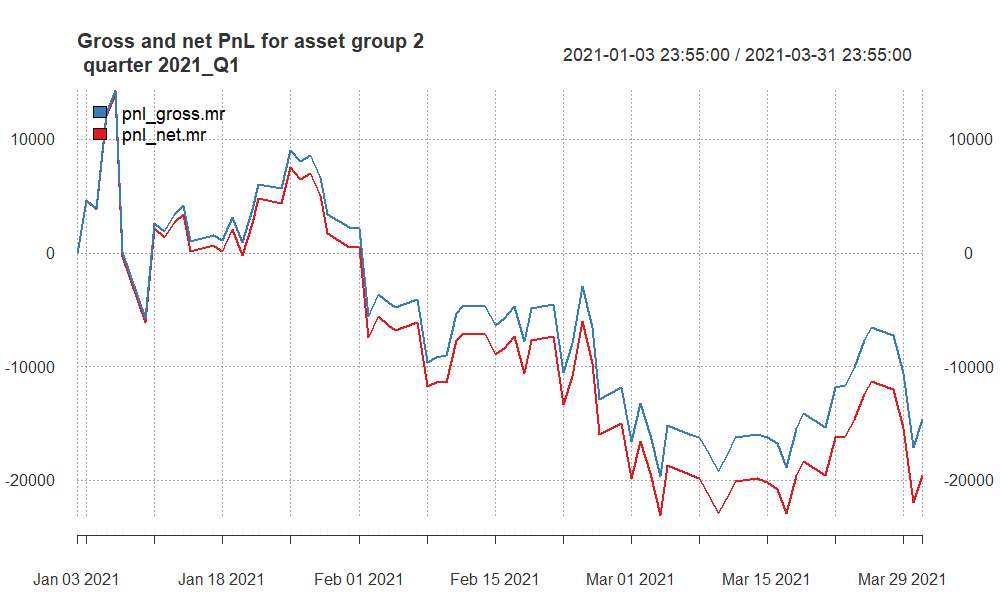

```

-   <font size="3">Substantial negative returns with both gross and net Sharpe Ratios in the negative.</font>

-   <font size="3">Negative Calmar Ratios indicate poor risk-adjusted performance.</font>

-   <font size="3">Significant losses in both gross and net profits.</font>

## PnL **Group 2** -- 2021Q3

```{r, echo = F, out.width ='80%'}
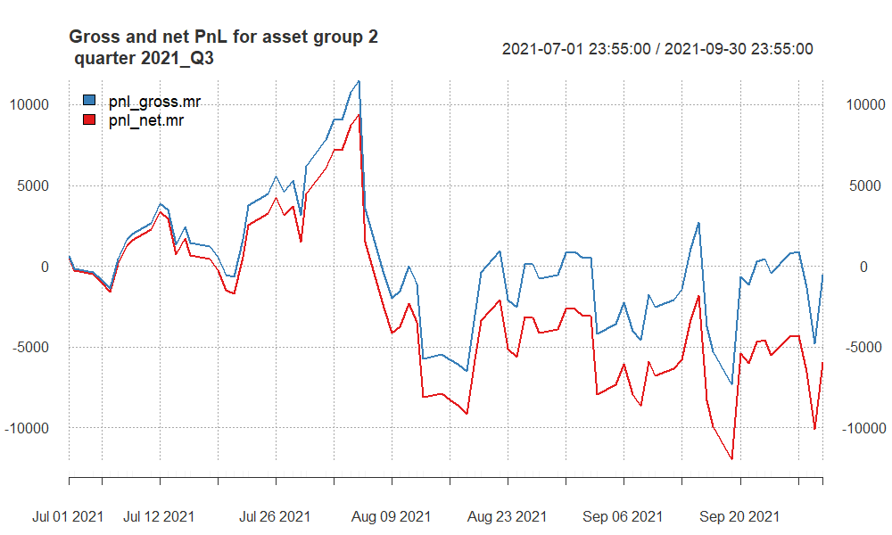

```

-   <font size="3">Almost \$6000 net loss comes from mainly unsuccessful trades and TCs.</font>

-   <font size="3">Negative CR ratios indicates poor risk-adjusted performance</font>

## PnL **Group 2** -- 2021Q4

```{r, echo = F, out.width ='80%'}
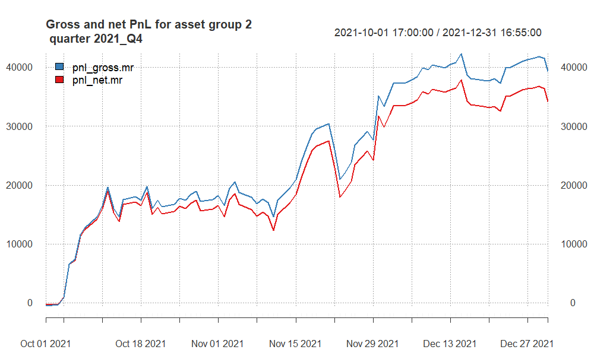

```

-   <font size="3">Strong positive performance with high Sharpe Ratios, indicating good risk-adjusted returns.</font>

-   <font size="3">High gross and net Calmar Ratios suggest favorable risk-adjusted performance.</font>

-   <font size="3">Significant positive gross and net profits, with a positive statistical measure.</font>

## PnL **Group 2** -- 2022Q2

```{r, echo = F, out.width ='80%'}
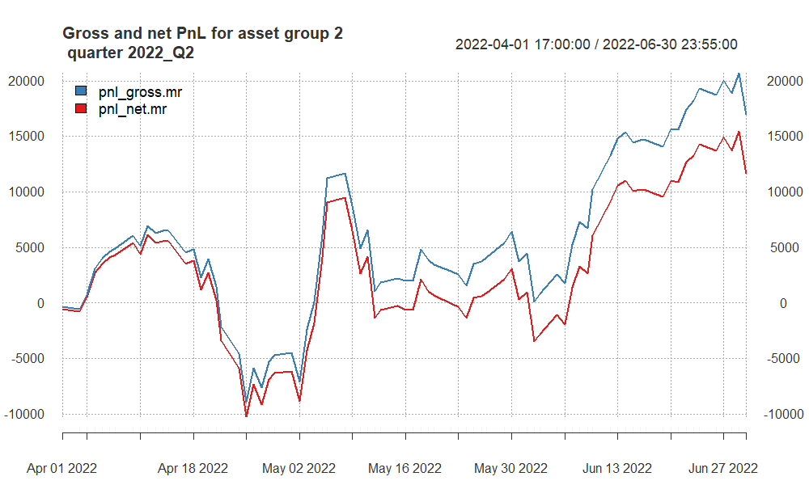

```

-   <font size="3">Positive gross and net Sharpe Ratios, indicating positive risk-adjusted returns.</font>

-   <font size="3">Positive gross and net Calmar Ratios suggest good risk-adjusted performance.</font>

-   <font size="3">Positive gross and net profits, with a positive statistical measure.</font>

## P&L **Group 2** -- 2022Q4

```{r, echo = F, out.width ='80%'}
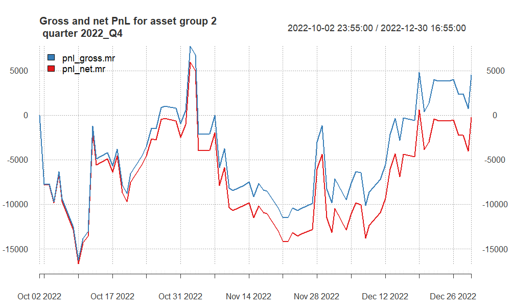

```

-   <font size="3">Even though it has \$4,500 Gross profit, after subtracting the costs, we have \$-238 net loss.</font>

-   <font size="3">We cannot see a particular trend, it has been zigzaging.</font>

## P&L **Group 2** -- 2023Q1

```{r, echo = F, out.width ='80%'}
knitr::include_graphics("pnl_group2_2023_Q1.png")

```

-   <font size="3">We cannot see the continuation of positive trend in terms of P&L from previous quarter.</font>

-   <font size="3">After reaching almost \$9,000 profit due to fluctuations it ended up in loss.</font>

## P&L **Group 2** -- 2023Q2

```{r, echo = F, out.width ='80%'}
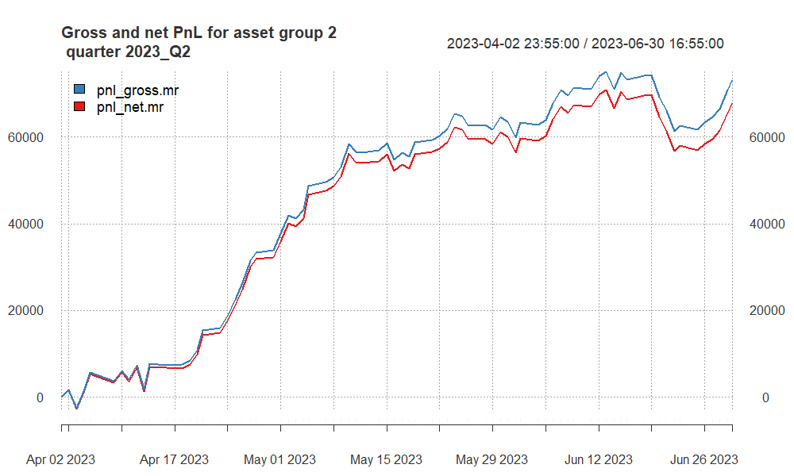

```

-   <font size="3">Very strong positive performance with Sharpe Ratios, indicating excellent risk-adjusted returns.</font>

-   <font size="3">High gross and net Calmar Ratios also suggest outstanding risk-adjusted performance.</font>

-   <font size="3">Significant positive gross and net profits, with a positive statistical measure.</font>

## Summary and conclusions

<font size="5">Implementing the portfolio approach in our analysis, we found that within the first group, the NASDAQ played a significant role, contributing 77% to the total profit and loss. Shifting focus to the second group, a concentrated strategy on commodities, particularly Silver, resulted in a noteworthy total profit of \$81,600. Noteworthy adjustments were made for Gold, including the application of higher memory exponential moving averages (EMAs) due to its elevated transaction costs.

In summary, our strategy exhibited consistent results during the in-sample period, albeit with performance fluctuations across quarters.</font>
