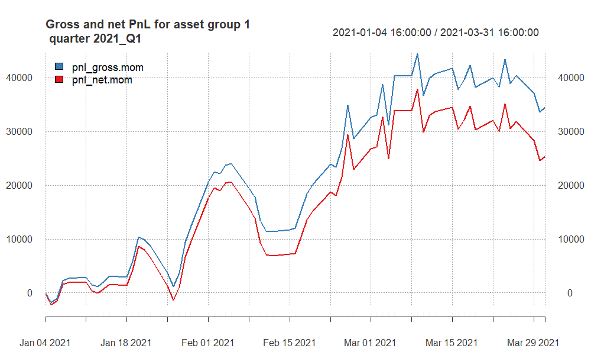
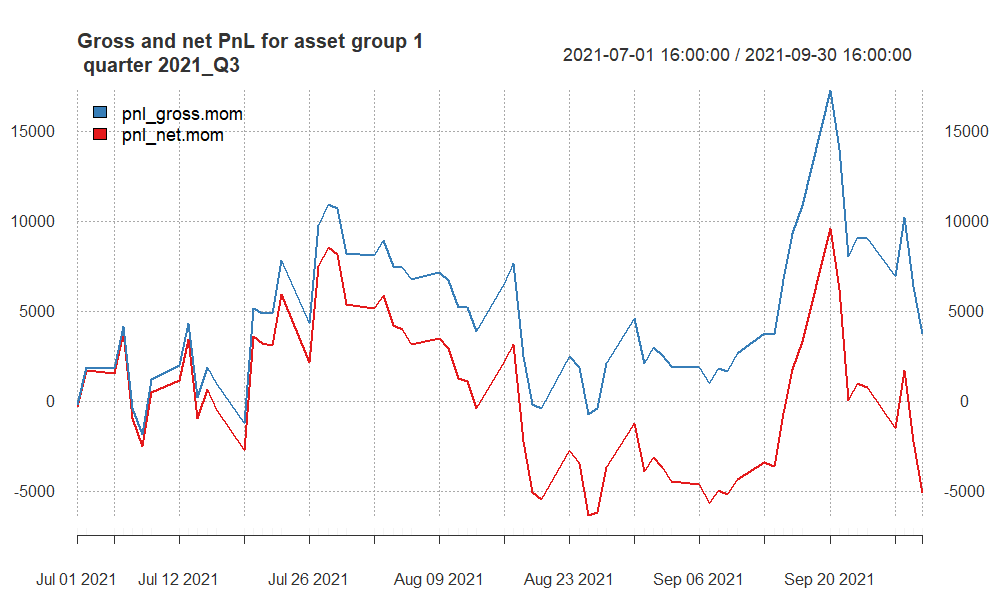
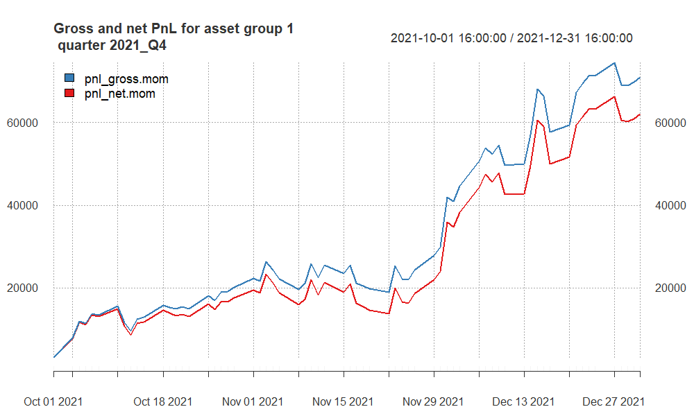
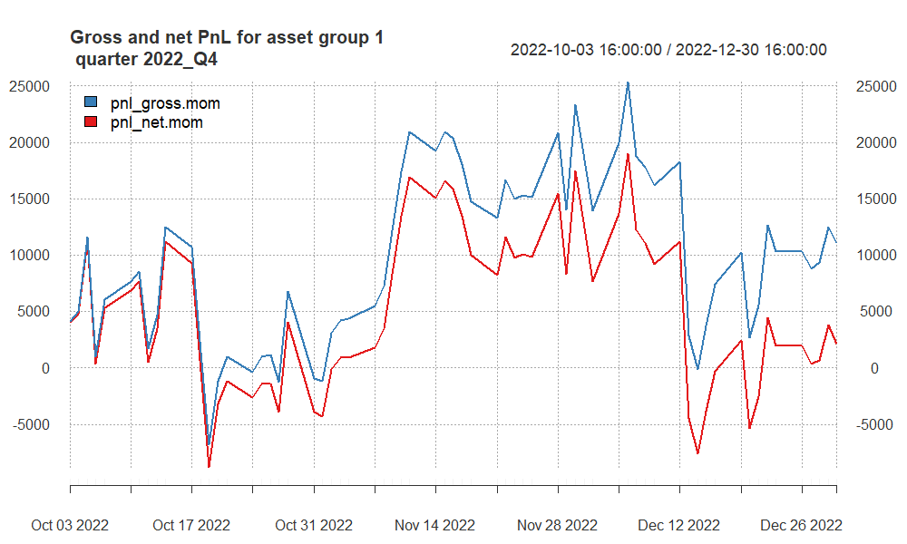
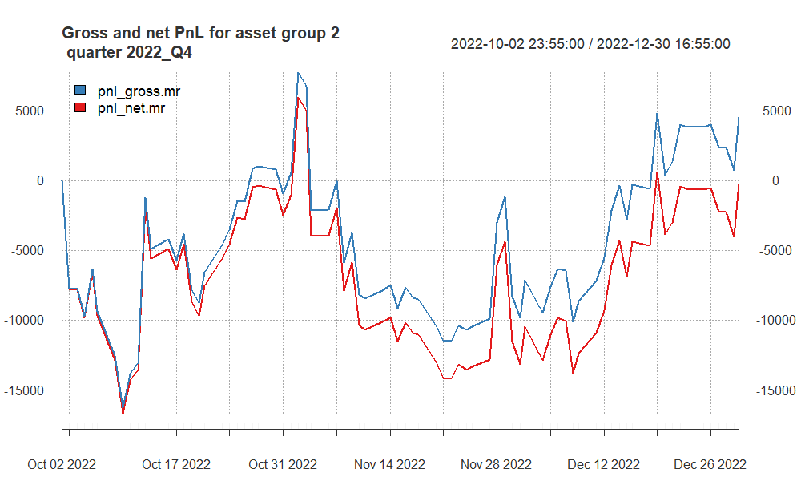

# Approaches undertaken

Our project focused on Moving Averages (MAs), utilizing Crossing EMAs and Single EMA for both asset groups. We optimized MA parameters for each asset, incorporating them into the portfolio based on Net P&L in both Momentum and Mean-Reverting Strategies.

No additional assumptions have been considered, only the commonly accepted ones for both Group 1 and Group 2.

To determine optimal MAs parameters, we utilized both the HeatMap method and manual exploration. When it comes to manual exploration, it was based on the open sources, such as books and forums which aims to test the parameters which are considered the "best" by public. Our primary focus was identifying the most profitable configurations across the entire timeframe. In cases where multiple settings proved lucrative, we assessed their consistency in generating profits on a quarterly basis.

# Group 1 -- summary of results (including out-of-sample)

## Finally selected strategy for group 1

When assessing Group 1 assets encompassing two indexes, our analysis spanned Momentum and Mean-Reverting strategies. However, we encountered challenges in achieving positive P&Ls with the Mean-Reverting approach. Consequently, our focus shifted towards a Trending strategy, for which we identified optimal parameters leading to favorable outcomes.

In comparing strategies, the Crossing EMAs technique exhibited superior P&Ls compared to the Single EMA method. As a result, we opted for the Crossing EMAs approach and implemented the following set of parameters:

`NASDAQ - 35/134`

`SP500 - 55/80`

```{r, echo = F, warning = F, message = F}
# here you can refer to the R codes that apply the strategy
# for asset group 1 to all quarters (in a loop)
source("best1.R")
```

## Summary of results for group 1

```{r, echo = F}
kable(quarter_stats.all.group1[, -2], 
                    "markdown", 
                    digits = 2,
                    align = "r")
```

Even though we have positive Gross P&L for most of the quarters, due to the transaction costs, our Net P&L has become negative for five quarters.These quarters are from Out-of-Sample data. However, in comparison with the quarters which are positive, these losses do not have a huge impact on our model's overall performance.

In reality, it is not always achievable to make profit consistently.

## PnL of results for **group 1** -- quarter 2021Q1

```{r, echo = F, out.width ='100%'}

```

Began with modest returns, saw a significant profit surge in the second part of the quarter, but ended with a decrease in Net P&L from roughly \$37,000 to \$25,000 due to unprofitable final transactions.

## PnL of results for **group 1** -- quarter 2021Q2

```{r, echo = F, out.width ='100%'}

```

For Q2 2021, our model experienced significant losses with both gross and net profit and loss (PnL) being negative. Performance ratios such as Sharpe and Calmar also turned negative, indicating a downturn in risk-adjusted returns and increased losses relative to the risk taken.

## PnL of results for **group 1** -- quarter 2021Q3

```{r, echo = F, out.width ='100%'}

```

It has the lowest Net P&L value. Especially recent transactions have completely eradicated any earnings. In general, there is a considerable amount of erratic movement, particularly with a negative impact.

## PnL of results for **group 1** -- quarter 2021Q4

```{r, echo = F, out.width ='100%'}

```

The quarter marked the highest profitability, yielding a net profit of around \$62,000. The strategy has consistently stayed in positive territory, ensuring a continuous stream of profits throughout the entire quarter. The higher Sharpe ratio and Stat indicates strong risk-adjusted returns and the statistical significance, respectively.

## PnL of results for **group 1** -- quarter 2022Q1

```{r, echo = F, out.width ='100%'}

```

For Q1 2022, our model showed strong positive performance with high gross and net profits and favorable risk-adjusted return ratios.

## PnL of results for **group 1** -- quarter 2022Q2

```{r, echo = F, out.width ='100%'}
knitr::include_graphics("pnl_group1_2022_Q2.png")
```

During this quarter, the number of average daily trades is the highest. The strategy proved itself in the mid-quarter, but ended up with negative return due to losses from positions as well as transaction costs.

## PnL of results for **group 1** -- quarter 2022Q3

```{r, echo = F, out.width ='100%'}

```

For Q3 2022, our model saw negative returns, with a decline in both gross and net profits, and negative performance ratios.

## PnL of results for **group 1** -- quarter 2022Q4

```{r, echo = F, out.width ='100%'}

```

This quarter shows positive success rates, gains before and after costs. The difference between Gross and Net is about \$9,000 - our gains from positions has not been that much, mostly small gains from a lot of positions. This is the reason why we have \$9,000 transaction costs.


## PnL of results for **group 1** -- quarter 2023Q1

```{r, echo = F, out.width ='100%'}
knitr::include_graphics("pnl_group1_2023_Q1.png")
```

The approach consistently maintained a profitable P&L, and recent transactions have propelled it to its peak P&L level. For such a significant profit, transaction costs are only \$ 8,000. Unlike 2022Q4, we have entered **fewer trades**, but **profitable** ones.

## PnL of results for **group 1** -- quarter 2023Q2

```{r, echo = F, out.width ='100%'}
knitr::include_graphics("pnl_group1_2023_Q2.png")
```

Following a challenging first half of the quarter marked by substantial losses, the strategy managed to recover in the latter part, yielding a profit of \$15,000. Unfortunately, the positive trend was short-lived, as the strategy experienced a subsequent decline, nearly reaching zero.

## PnL of results for **group 1** -- quarter 2023Q3

```{r, echo = F, out.width ='100%'}

```

In Q3 2023, our model faced a downturn with negative gross and net profits, and a decline in performance ratios.

## PnL of results for **group 1** -- quarter 2023Q4

```{r, echo = F, out.width ='100%'}

```

In Q4 2023, our model showed positive results with improved gross and net profits and better performance ratios compared to the previous quarter.

# Group 2 -- summary of results (including out-of-sample)

## Finally selected strategy for group 2

For Group 2 assets which includes two currencies and two commodities, we checked Momentum and Mean-Reverting strategies. Based on our research we decided to continue with to Mean-Reverting strategy because of its profitability.

We started with finding the optimal parameters for each of them individually, and then combining as a portfolio the ones that reached desirable outcomes.

After our research, we decided to remove AUD and CAD. They didn't yield much profit and the results was not reliable for such reason.

The P&Ls of Crossing EMAs was higher that Single EMA technique, so we preferred Crossing EMAs approach and used below parameters:

`XAG - 67/118`

`XAU - 191/570`

```{r, echo = F, warning = F, message = F}
# here you can refer to the R codes that apply the strategy
# for asset group 2 to all quarters (in a loop)
source("best2.R")
```


## Summary of results for group 2

```{r, echo = F}
kable(quarter_stats.all.group2[, -2], 
                    "markdown", 
                    digits = 2,
                    align = "r")

# more options here:
# https://haozhu233.github.io/kableExtra/awesome_table_in_html.html
```

The strategy experienced mixed performance in the initial quarters of in-sample data, marked by negative returns and varying risk-adjusted metrics. However, it showed a significant improvement in later quarters, including out-of-sample data, especially in Q2 2021, Q4 2021 and Q2 2023, with strong positive performance, high Sharpe and Calmar Ratios, and substantial profits.

## PnL of results for **group 2** -- quarter 2021Q1

```{r, echo = F, out.width ='100%'}
knitr::include_graphics("pnl_group2_2021_Q1.png")
```

- Substantial negative returns with both gross and net Sharpe Ratios in the negative.
- Negative Calmar Ratios indicate poor risk-adjusted performance.
- Significant losses in both gross and net profits.

## PnL of results for **group 2** -- quarter 2021Q2

```{r, echo = F, out.width ='100%'}

```

In Q2 2021, our model had a positive performance with both gross and net profit and loss showing gains. Performance ratios like Sharpe and Calmar were also in the positive range, indicating good risk-adjusted returns.

## PnL of results for **group 2** -- quarter 2021Q3

```{r, echo = F, out.width ='100%'}
knitr::include_graphics("pnl_group2_2021_Q3.png")
```

- Almost \$6000 net loss comes from mainly unsuccessful trades and TCs.
- Negative CR ratios indicates poor risk-adjusted performance.

## PnL of results for **group 2** -- quarter 2021Q4

```{r, echo = F, out.width ='100%'}
knitr::include_graphics("pnl_group2_2021_Q4.png")
```

- Strong positive performance with high Sharpe Ratios, indicating good risk-adjusted returns.
- High gross and net Calmar Ratios suggest favorable risk-adjusted performance.
- Significant positive gross and net profits, with a positive statistical measure.

## PnL of results for **group 2** -- quarter 2022Q1

```{r, echo = F, out.width ='100%'}

```

In Q1 2022, our model had a negative quarter with losses in both gross and net PnL and negative performance ratios.

## PnL of results for **group 2** -- quarter 2022Q2

```{r, echo = F, out.width ='100%'}
knitr::include_graphics("pnl_group2_2022_Q2.png")

```

- Positive gross and net Sharpe Ratios, indicating positive risk-adjusted returns.
- Positive gross and net Calmar Ratios suggest good risk-adjusted performance.
- Positive gross and net profits, with a positive statistical measure.

## PnL of results for **group 2** -- quarter 2022Q3

```{r, echo = F, out.width ='100%'}

```

In Q3 2022, our model saw modest gains in gross PnL and a slight profit in net PnL, with performance ratios close to zero, indicating a relatively stable but not highly profitable quarter.

## PnL of results for **group 2** -- quarter 2022Q4

```{r, echo = F, out.width ='100%'}

```

- Even though it has \$4,500 Gross profit, after subtracting the costs, we have \$-238 net loss.
- We cannot see a particular trend, it has been zigzaging.

## PnL of results for **group 2** -- quarter 2023Q1

```{r, echo = F, out.width ='100%'}
knitr::include_graphics("pnl_group2_2023_Q1.png")
```

- We cannot see the continuation of positive trend in terms of P&L from previous quarter.
- After reaching almost \$9,000 profit due to fluctuations it ended up in loss.

## PnL of results for **group 2** -- quarter 2023Q2

```{r, echo = F, out.width ='100%'}
knitr::include_graphics("pnl_group2_2023_Q2.png")
```

- Very strong positive performance with Sharpe Ratios, indicating excellent risk-adjusted returns.
- High gross and net Calmar Ratios also suggest outstanding risk-adjusted performance.
- Significant positive gross and net profits, with a positive statistical measure.

## PnL of results for **group 2** -- quarter 2023Q3

```{r, echo = F, out.width ='100%'}

```

In Q3 2023, our model experienced a modest gross profit with slight overall net losses, indicating some positive movement but with costs impacting final gains.

## PnL of results for **group 2** -- quarter 2023Q4

```{r, echo = F, out.width ='100%'}

```

In Q4 2023, our model experienced losses, with both gross and net PnL trending downwards and negative performance ratios.

# Summary and conclusions

The performance of our selected strategies was mixed, with some quarters showing significant profits, while others incurred losses. This variance can be attributed to the inherent volatility and unpredictability of high-frequency trading markets.

## Group 1 Performance:

The strategy secured consistent profits in several quarters, with 2021Q1, 2021Q4, 2022Q1 and 2023Q1 being particularly notable for their high net profits and favorable risk-adjusted return ratios.
However, some quarters, such as 2021Q2, 2022Q3 2023Q3, presented challenges, resulting in negative gross and net PnL.

## Group 2 Performance:

Group 2's strategy exhibited strong performance in quarters such as 2021Q2, 2021Q4, 2022Q2 and 2023Q2, marked by high Sharpe and Calmar Ratios and substantial net profits.
Contrarily, quarters like 2022Q1 and 2023Q4 demonstrated downturns with negative returns across both gross and net PnL.
Concluding Remarks
Our exploration into quantitative strategies reveals the complexity and dynamic nature of high-frequency trading. While we found success in certain periods, the strategies were not immune to losses, underscoring the need for continuous adaptation and risk management.

**In conclusion**, our project underscores the potential of quantitative strategies in high-frequency data. However, it also serves as a reminder that profitability is not guaranteed, and a prudent trading approach should be balanced with rigorous risk assessment and management strategies to navigate the volatile trading landscape effectively.