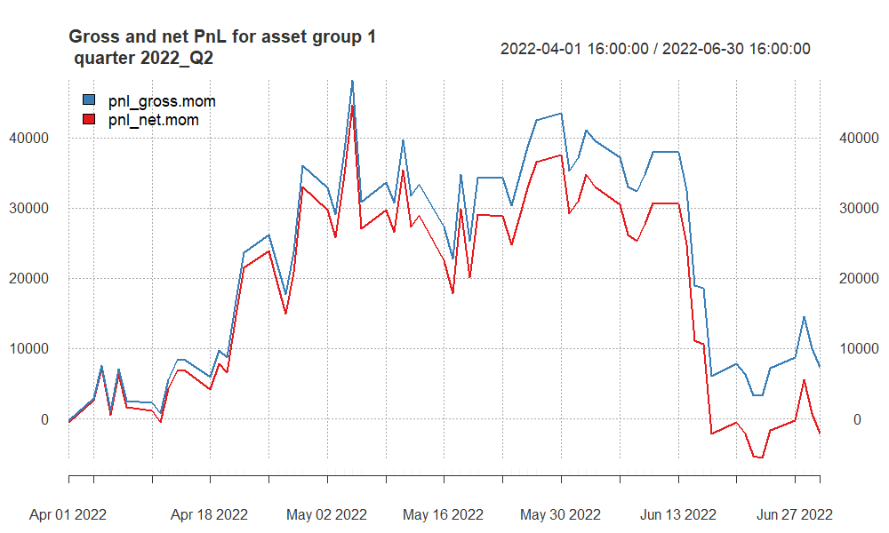
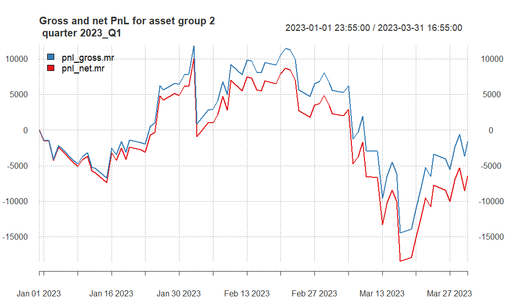
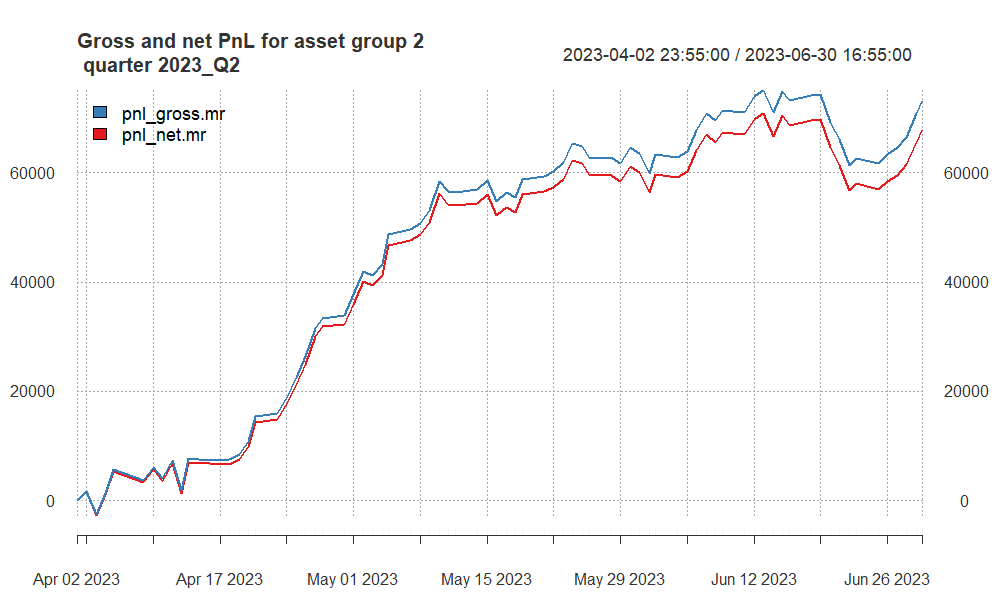

## Approaches undertaken

On the project, we have taken the Moving Average strategies mainly. For both, we have preferred to use Trend-Following strategies. And our entry technique was Crossing Moving Averages. In order to test it, we run multiple times 

This part should describe **in short** what particular methods you used, all entry/exit techniques considered, all additional assumptions.

For **each group of assets separately** You should also explain **WHAT different parameters** you considered.

You should also explain with details **HOW** you searched for the best combination of parameters for a particular group of assets.


## Finally selected strategy for **group 1**

Provide a **general summary** (approach and a set of **final parameters**) for assets from **group 1**.
(e.g. momentum strategy, cross over of two exponential moving averages EMA10 and EMA60).


<!-- here you can include code chunk that applies the strategy for group 1 and calculates all the summary statistics
-->

```{r, echo = F, warning = F, message = F}
# here you can refer to the R codes that apply the strategy
# for asset group 1 to all quarters (in a loop)

source("1 - Strategy.R")
```


## Summary of results for **group 1**

```{r, echo = F}
names(quarter_stats.all.group1)[5] <- "av.ntrades"
column_spec(
kable_styling(kable(quarter_stats.all.group1[, -2], 
                    "html", 
                    digits = 2,
                    align = "r"),
             font_size = 20),
1:7, width = "30em")

# more options here:
# https://haozhu233.github.io/kableExtra/awesome_table_in_html.html
```


your comments required !!!

## PnL of results for **group 1** -- quarter 2021Q1

```{r, echo = F, out.width ='100%'}
knitr::include_graphics("pnl_group1_2021_Q1.png")

```
your comments required !!!

## PnL of results for **group 1** -- quarter 2021Q3

```{r, echo = F, out.width ='100%'}
knitr::include_graphics("pnl_group1_2021_Q3.png")

```
your comments required !!!

## PnL of results for **group 1** -- quarter 2021Q4

```{r, echo = F, out.width ='100%'}
knitr::include_graphics("pnl_group1_2021_Q4.png")

```
your comments required !!!


## PnL of results for **group 1** -- quarter 2022Q2

```{r, echo = F, out.width ='100%'}


```

your comments required !!!

## PnL of results for **group 1** -- quarter 2022Q4

```{r, echo = F, out.width ='100%'}
knitr::include_graphics("pnl_group1_2022_Q4.png")

```
your comments required !!!

## PnL of results for **group 1** -- quarter 2023Q1

```{r, echo = F, out.width ='100%'}
knitr::include_graphics("pnl_group1_2023_Q1.png")

```
your comments required !!!

## PnL of results for **group 1** -- quarter 2023Q2

```{r, echo = F, out.width ='100%'}
knitr::include_graphics("pnl_group1_2023_Q2.png")

```

your comments required !!!


## Finally selected strategy for **group 2**

Provide a **general summary** (approach and a set of **final parameters**) for assets from **group 2**.
(e.g. momentum strategy, cross over of two exponential moving averages EMA10 and EMA60 - if DIFFERENT strategy used for each asset, you should explain EACH separately.).


<!-- here you can include code chunk that applies the strategy for group 1 and calculates all the summary statistics
-->

```{r, echo = F, warning = F, message = F}
# here you can refer to the R codes that apply the strategy
# for asset group 2 to all quarters (in a loop)

source("2 - Strategy.R")
```


## Summary of results for **group 2**

```{r, echo = F}
names(quarter_stats.all.group2)[5] <- "av.ntrades"
column_spec(
kable_styling(kable(quarter_stats.all.group2[, -2], 
                    "html", 
                    digits = 2,
                    align = "r"),
             font_size = 20),
1:7, width = "30em")

# more options here:
# https://haozhu233.github.io/kableExtra/awesome_table_in_html.html
```

your comments required !!!

## PnL of results for **group 2** -- quarter 2021Q1

```{r, echo = F, out.width ='100%'}
knitr::include_graphics("pnl_group2_2021_Q1.png")

```

your comments required !!!

## PnL of results for **group 2** -- quarter 2021Q3

```{r, echo = F, out.width ='100%'}
knitr::include_graphics("pnl_group2_2021_Q3.png")

```

your comments required !!!

## PnL of results for **group 2** -- quarter 2021Q4

```{r, echo = F, out.width ='100%'}
knitr::include_graphics("pnl_group2_2021_Q4.png")

```
your comments required !!!

## PnL of results for **group 2** -- quarter 2022Q2

```{r, echo = F, out.width ='100%'}
knitr::include_graphics("pnl_group2_2022_Q2.png")

```
your comments required !!!

## P&L of results for **group 2** -- quarter 2022Q4

```{r, echo = F, out.width ='100%'}
knitr::include_graphics("pnl_group2_2022_Q4.png")

```
your comments required !!!

## P&L of results for **group 2** -- quarter 2023Q1

```{r, echo = F, out.width ='100%'}


```
your comments required !!!

## P&L of results for **group 2** -- quarter 2023Q2

```{r, echo = F, out.width ='100%'}


```
your comments required !!!

## Summary and conclusions

Here you should include a summary of obtained results and some conclusions.